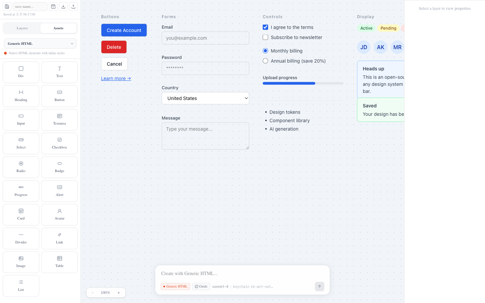
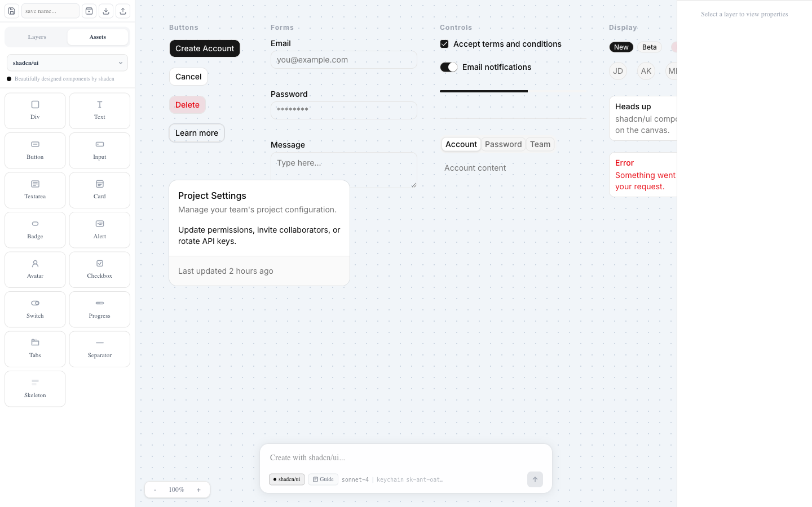
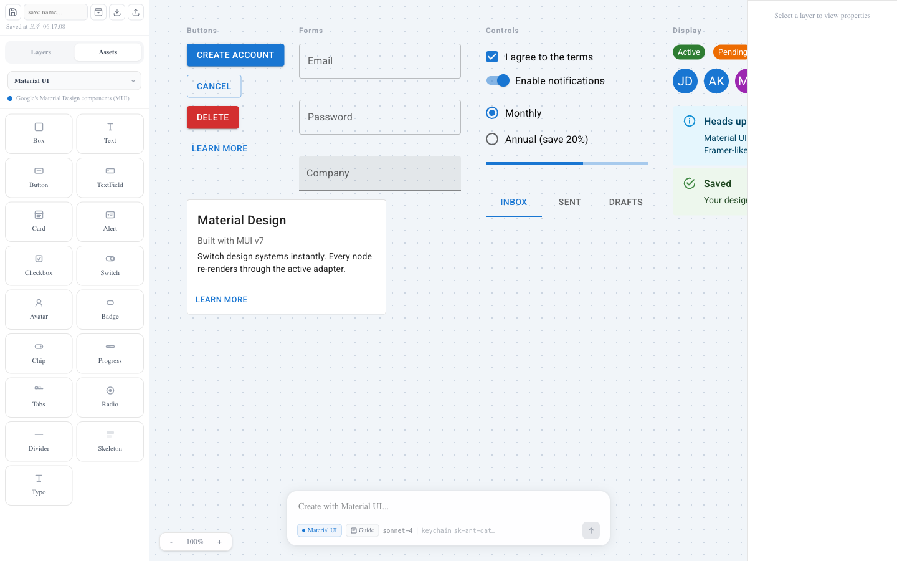

# Design System Canvas

A Framer-like DOM canvas for **real React components**. Drop a Button onto the canvas, drag it around, edit its props in the right panel — and the actual `<Button>` from your design system renders live. Switch between **HTML**, **shadcn/ui**, and **MUI** with one click. Generate or edit selections with AI, then **export the whole canvas as a runnable Vite + React project**.



The same canvas, switched to **shadcn/ui** and **MUI**:

| shadcn/ui | Material UI |
|---|---|
|  |  |

## Why

Most design tools render mock UI. This one renders the real components — the same ones that ship to production. That means:

- What you see is exactly what your app will look like
- You can prototype against your real design system, not a Figma approximation
- You can export the canvas to working React code

## Features

- **Multi design system canvas** — switch the active design system at any time; every node re-renders through the new adapter
- **Pluggable adapter API** — add a new design system in one file (see [`docs/adding-design-system.md`](docs/adding-design-system.md))
- **AI edit & generate** — natural-language prompts create new layouts or modify the selected node, with a per-DS guide that constrains the AI's output
- **Layers, properties, drag, resize, zoom, pan** — the basics you expect from a canvas tool
- **Save / load** designs to local JSON files
- **Export** any node (or the whole canvas) as a downloadable Vite + React project

## Bundled design systems

| ID | Name | Notes |
|---|---|---|
| `html` | Generic HTML | Native elements with inline styles, zero deps |
| `shadcn` | shadcn/ui | Local components in `components/ui/`, Tailwind-based |
| `mui` | Material UI | `@mui/material` v7 |

You can keep these, swap them, or add your own.

## Getting started

```bash
npm install
npm run dev
```

Open http://localhost:3000.

The bottom bar lets you switch design systems, prompt the AI, save, and export.

## AI edit (optional)

The AI features call the Anthropic API. The server route auto-detects credentials in this order:

1. `ANTHROPIC_API_KEY` env var
2. macOS Keychain (`Claude Code-credentials`) — for users of [Claude Code](https://github.com/anthropics/claude-code)
3. `~/.claude/.credentials.json`

Without any of those, the canvas still works — only the AI prompt bar is disabled.

To override the model, set one of `CLAUDE_MODEL`, `CLAUDE_CODE_MODEL`, `ANTHROPIC_MODEL`, `ANTHROPIC_DEFAULT_MODEL`. Defaults to `claude-sonnet-4-20250514`. See `.env.example`.

## Adding a design system

The adapter pattern is documented in [`docs/adding-design-system.md`](docs/adding-design-system.md). Short version:

1. Create `app/design-systems/yourds.tsx` exporting a `DesignSystemAdapter`
2. Add `import "./yourds";` to `app/design-systems/init.ts`
3. (Optional) Drop a `guides/yourds.md` style guide for the AI to follow

Each adapter declares:
- `renderComponent(node)` — how to render each component type
- `catalog` — the items shown in the left Assets panel
- `aiSchema` — string used when prompting the AI
- `exportConfig` — how to generate import statements & `package.json` for exported projects

## Project layout

```
app/
├── api/                # AI edit, saves, designs, guides routes
├── components/         # Canvas UI: Sidebar, Renderer, Properties, BottomBar
├── design-systems/     # Adapters: html, shadcn, mui (+ registry, context)
├── store/              # Canvas state reducer & context
├── utils/exportProject.ts  # Vite project zip generator
├── globals.css
├── layout.tsx
└── page.tsx
components/ui/          # shadcn primitives used by the shadcn adapter
guides/                 # AI usage guides per design system
docs/                   # Developer docs + screenshots
```

## Tech stack

- Next.js 16 (App Router) + React 19
- Tailwind CSS v4
- shadcn/ui primitives, MUI v7
- Anthropic SDK via fetch (streaming) for AI edits
- JSZip for project export

## License

MIT
